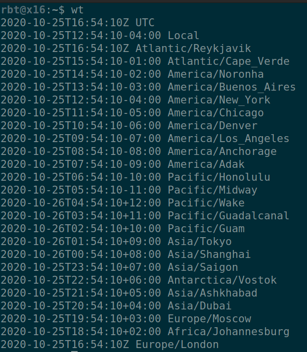
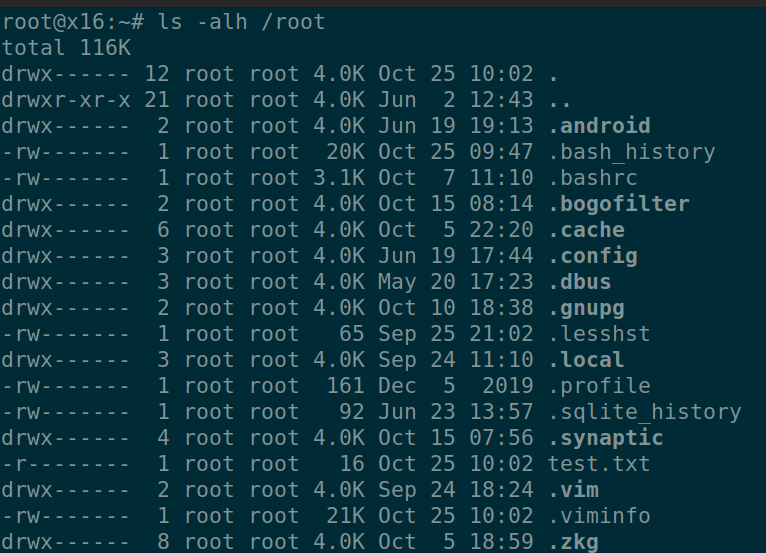
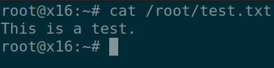
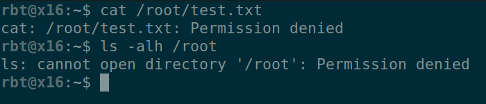
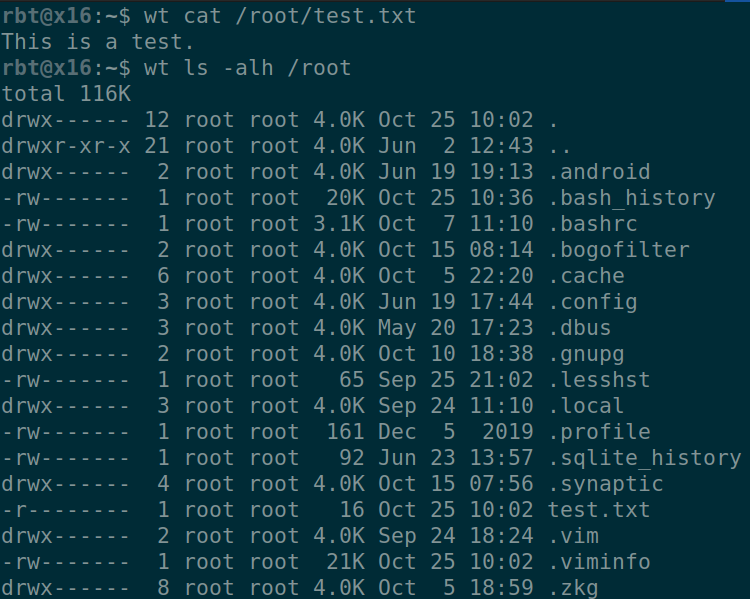
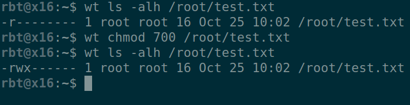

# world-time (wt)

wt is an example of how normal users can use custom written SUID programs (owned by root) to gain root privileges on Linux systems. When executed without arguments, wt displays some times from around the world then exits. When executed with arguments, it runs those arguments. **SUID programs owned by root are dangerous.** They can be used by normal users to compromise or maintain administrative control of previously compromised Linux systems.



## Installation

**Do not install wt on systems without the full knowledge and consent of the system's owner.**

Normal users may install wt themselves. /home/user/bin is a good spot and is the default in the Makefile, but anywhere will do.

```bash
user@host:~$ make
user@host:~$ make install
```

Before the normal user can fully use wt, root would have to chown and chmod wt.

```bash
root@host:~# chown root:root /home/user/bin/wt
root@host:~# chmod 4755 /home/user/bin/wt
```

An experienced sys admin should never run those two commands. However, they may be accustom to running vendor installation scripts or audit scripts as root. And, they are busy, and sometimes bullied by management to 'just do what we say' so some sys admins may just run whatever shell script they are given without question. Of course, the sys admin will be blamed by management later for not carefully taking time to read the script.

## Running

Normally, due to basic Linux file permissions, only root may ls /root and cat files under /root.




And, normal users cannot.



But, by using wt, normal users can do this and more.




I'll stop the demonstration here, but much more could be done with a malicious or poorly written SUID program. Root files can be copied, modified, etc. 

## Preventing SUID Files

Sys admins should carefully read every shell script that they did not write themselves before running them.

## Finding SUID Files

On most Linux systems, the find command can be used to locate SUID files. Any SUID file that is not expected should be scrutinized and potentially chmoded to something safer (755) or removed from the system.

```bash
root@host:~# find /usr -perm /4000 2> /dev/null
```

## Notes

  * wt is a simple toy program intended for educational purposes only.
  * Do not install wt on systems without the full knowledge and consent of the system's owner.
